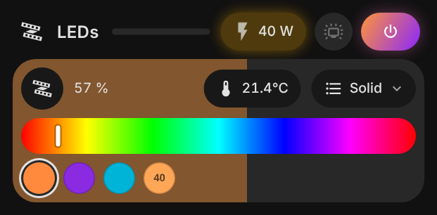
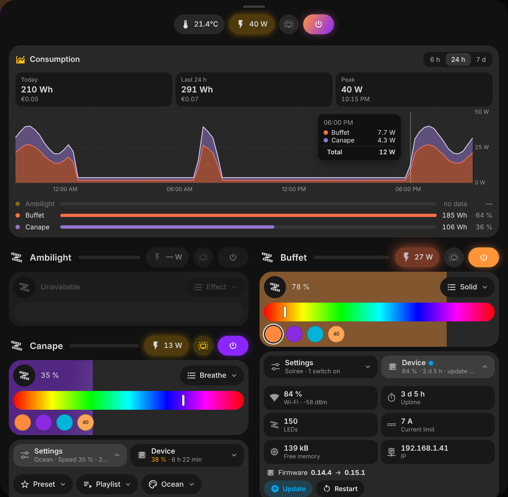
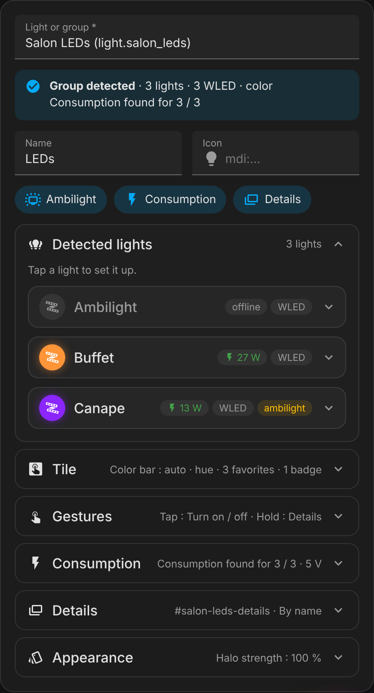

# Vivid Cards

Expressive Lovelace cards for Home Assistant. Badges glow with the state of what
they show: a power button lit with the real color of your LEDs, a consumption
badge that shines brighter the more a strip draws.

<p>
  
</p>

- **No dependencies.** One JavaScript file, no other custom card required.
- **Zero templating.** Point a card at a light or a group: members, WLED
  entities and power sensors are discovered from the Home Assistant registries.
- **Visual editor.** Everything can be set without YAML, and the editor only
  shows what applies to the light you picked.
- **Theme aware.** Follows your Home Assistant theme, light or dark, in English
  and French.

| Card                                  | What it is for                                                      |
| ------------------------------------- | ------------------------------------------------------------------- |
| [`vivid-led-group`](#vivid-led-group) | A light group or a single light, WLED aware, with details per light |

More cards and badges (battery, doors and windows, presence, illuminance…) are on
the [roadmap](#roadmap).

## Installation

Requires Home Assistant 2024.11 or newer.

### HACS (recommended)

[](https://my.home-assistant.io/redirect/hacs_repository/?owner=Florian-BARRE&repository=vivid-cards&category=plugin)

Click the button above, or add it by hand:

1. In HACS, open the menu (⋮) → **Custom repositories**.
2. Add `https://github.com/Florian-BARRE/vivid-cards` with the type **Dashboard**.
3. Search for **Vivid Cards** and download it.

HACS adds the dashboard resource for you; reload the page afterwards. Updates
show up in HACS like any other download.

### Manual

1. Download `vivid-cards.js` from the [latest release](https://github.com/Florian-BARRE/vivid-cards/releases/latest).
2. Copy it to `config/www/vivid-cards/vivid-cards.js`.
3. Add a dashboard resource: **Settings → Dashboards → ⋮ → Resources → Add resource**,
   URL `/local/vivid-cards/vivid-cards.js`, type **JavaScript module**.
4. Reload the page.

## Quick start

1. Open a dashboard, **⋮ → Edit dashboard → Add card**, and search for
   **Vivid LED group**.
2. Pick a light or a light group. The editor tells you what it found: how many
   lights, which ones are WLED, whether they do color or tunable white, and
   where their consumption comes from.
3. If no consumption is found, open **Consumption** and give a sensor pattern
   (see [where consumption comes from](#where-consumption-comes-from)) or, for
   WLED strips, their voltage.
4. Save. Tap the name or hold the tile to open the details.

The same card in YAML:

```yaml
type: custom:vivid-led-group
entity: light.living_room_leds
```

## vivid-led-group

A light group (or one light) as a header and a brightness tile, with every light
of the group in a details dialog. Works with any light: Hue, Zigbee, ESPHome…
WLED strips also get the ambilight button, presets, palettes, effect speed and
device information.

<p>
  
</p>

### What the card shows

- **Header**: name, consumption badge glowing with the power drawn, ambilight
  button (WLED), power button filled with the light color (a gradient of every
  lit light for a group).
- **Tile**: drag to dim, effect picker, color bar (hue or color temperature),
  entity badges and favorite colors. The tile shimmers while an effect runs.
- **Details** (groups):
  - the group badges;
  - a **consumption chart** over 6 hours, 24 hours or 7 days, one color per
    light, with a cursor that reads every light at a given time, the energy
    used today and over the period, its cost and the peak;
  - every light with its own header and tile;
  - for WLED strips, two foldable panels: **Settings** (preset, playlist,
    palette, effect speed and intensity, reverse, freeze, nightlight, sync) and
    **Device** (Wi-Fi, uptime, LEDs, current limit, memory, IP, firmware, update
    and restart).

  Two columns on large screens, a bottom sheet on phones.

### Visual editor

<p>
  
</p>

Pick a light or a group first: the editor shows what it detected and only
offers what applies. The three switches on top turn the ambilight button, the
consumption badges and the details on or off. Everything else is folded into
sections that summarize their settings:

| Section             | What it sets                                                                                    |
| ------------------- | ----------------------------------------------------------------------------------------------- |
| **Detected lights** | Per light: ambilight, how consumption is measured, name, icon, transition, shown in the details |
| **Tile**            | Color bar, state text, effect picker, favorite colors, badges, brightness, transition           |
| **Gestures**        | Tap, hold and double tap                                                                        |
| **Consumption**     | Sensor pattern, strip voltage, price, glow scale                                                |
| **Details**         | Link (hash), order, color bar, what the details show                                            |
| **Appearance**      | Glow, header, compact layout, gradient, shimmer                                                 |

The YAML only keeps what you changed. Actions richer than a toggle (navigate,
perform-action…) are kept as they are and shown as **Custom (YAML)**.

### Gestures

| Where             | Tap                                   | Hold                         | Drag                               |
| ----------------- | ------------------------------------- | ---------------------------- | ---------------------------------- |
| Tile              | `tile.tap_action` (toggle)            | `tile.hold_action` (details) | Set the brightness (0 % turns off) |
| Color bar         | Pick the hue or the color temperature |                              | Same                               |
| Favorite color    | Apply it                              |                              |                                    |
| Badge             | Home Assistant dialog of the entity   |                              |                                    |
| Name              | Open the details                      |                              |                                    |
| Power button      | Toggle                                |                              |                                    |
| Consumption badge | History of the power sensor (lights)  |                              |                                    |
| Ambilight button  | Switch the WLED live override         |                              |                                    |
| Chart             | Read the values at that time          |                              | Same                               |

A double tap runs `tile.double_tap_action` (nothing by default). Without
details (a single light, or `details.enabled: false`), holding the tile opens
the Home Assistant dialog. In the details dialog, a tap on a light's tile
toggles it and a hold opens its Home Assistant dialog. The details close with
Escape, a tap outside, or a swipe down on phones.

### Recipes

**WLED strips with a power sensor each** (a template or a smart plug):

```yaml
type: custom:vivid-led-group
entity: light.salon_leds
power:
  sensor_pattern: sensor.{object_id}_power
```

**WLED strips without power sensors**: WLED estimates its current; give the
strip voltage to turn it into watts. The glow then scales on WLED's own current
limit.

```yaml
type: custom:vivid-led-group
entity: light.salon_leds
power:
  voltage: 5
```

**Any other lights** (here two tunable white spots, one on a smart plug): the
power sensor of each device is found on its own, the color bar switches to
temperature.

```yaml
type: custom:vivid-led-group
entity: light.kitchen_spots
name: Spots
tile:
  favorites: [{ kelvin: 2700 }, { kelvin: 4000 }, { kelvin: 6000 }]
```

**A small tile for a grid**: no header, smaller controls.

```yaml
type: custom:vivid-led-group
entity: light.desk
appearance:
  header: false
  compact: true
```

**Open the details from another card**:

```yaml
# On the LED card
details:
  hash: salon-leds
# On any other card
tap_action:
  action: navigate
  navigation_path: '#salon-leds'
```

**Everything at once**:

```yaml
type: custom:vivid-led-group
entity: light.salon_leds
name: LEDs
badges:
  - sensor.salon_temperature
tile:
  favorites: ['#ff8a3d', '#8a2be2', { kelvin: 2700, brightness: 40 }]
  transition: 0.5
power:
  sensor_pattern: sensor.{object_id}_power
  voltage: 5
  price: 0.2516
details:
  hash: salon-leds
  sort: custom
  order: [light.salon_tv_wled, light.salon_sofa_wled]
appearance:
  glow: strong
members:
  - entity: light.salon_sofa_wled
    name: Sofa
    transition: 2
  - entity: light.salon_backlight_wled
    ambilight: false
```

### Options

| Option       | Default      | Description                                                                    |
| ------------ | ------------ | ------------------------------------------------------------------------------ |
| `entity`     | required     | A light group, or a single light.                                              |
| `name`       | entity name  | Title of the card.                                                             |
| `icon`       | each light's | Icon of the card and of every light. By default each light keeps its own icon. |
| `tile`       | see below    | Brightness tile.                                                               |
| `badges`     | none         | Entities shown on the tile and on top of the details.                          |
| `power`      | see below    | Consumption badges, chart and cost.                                            |
| `ambilight`  | see below    | WLED ambilight button.                                                         |
| `details`    | see below    | Details dialog.                                                                |
| `appearance` | see below    | Glow, layout and animations.                                                   |
| `members`    | none         | Per-light overrides.                                                           |

`tile`:

| Option              | Default      | Description                                                                                                    |
| ------------------- | ------------ | -------------------------------------------------------------------------------------------------------------- |
| `color_bar`         | `auto`       | `auto` (hue for color lights, temperature for tunable whites, none otherwise), `hue`, `temperature` or `none`. |
| `state`             | `brightness` | Text on the tile: `brightness` or `none`.                                                                      |
| `effects`           | `true`       | Effect picker.                                                                                                 |
| `favorites`         | none         | Up to 8 colors: `"#ff8800"`, `[255, 136, 0]`, `{ kelvin: 2700 }`, each with an optional `brightness` (%).      |
| `brightness_min`    | `1`          | Lowest brightness (%) a drag sets; dragging to the left edge still turns off.                                  |
| `brightness_step`   | `1`          | Brightness step (%) of a drag.                                                                                 |
| `transition`        | none         | Seconds of fade sent with every light command.                                                                 |
| `tap_action`        | `toggle`     | Any Home Assistant action, plus `details`.                                                                     |
| `hold_action`       | `details`    | `details` for a group, `more-info` for a single light.                                                         |
| `double_tap_action` | `none`       | Same syntax.                                                                                                   |

Actions accept a name (`toggle`, `details`, `more-info`, `none`) or the usual
object: `navigate`, `url`, `perform-action`…

`badges` entries are entity ids, or `{ entity, name, icon }`. Sensors show
their value, on/off entities light up while on.

`power`:

| Option           | Default | Description                                                                                                                                            |
| ---------------- | ------- | ------------------------------------------------------------------------------------------------------------------------------------------------------ |
| `enabled`        | `true`  | Consumption badges and chart.                                                                                                                          |
| `sensor_pattern` | none    | Power sensor of each light. `{object_id}` is replaced by the light's object id: `sensor.{object_id}_power` finds `sensor.desk_power` for `light.desk`. |
| `voltage`        | none    | Strip voltage. Turns the WLED estimated current into watts.                                                                                            |
| `price`          | none    | Price of a kWh: the details show what today and the period cost.                                                                                       |
| `currency`       | HA's    | Currency code of the price, e.g. `EUR`.                                                                                                                |
| `idle`           | `3`     | Watts per light under which the badge stays neutral.                                                                                                   |
| `max`            | auto    | Watts per light at which the glow is the brightest. Without it, WLED's current limit × voltage when known, else 40.                                    |
| `steps`          | auto    | Watts per light where the glow turns from the first color to the second, then the third. They follow `max` unless set.                                 |
| `colors`         | yellow… | Three colors of the glow, low to high.                                                                                                                 |

`ambilight`:

| Option    | Default | Description                                                          |
| --------- | ------- | -------------------------------------------------------------------- |
| `enabled` | `true`  | WLED ambilight button (shown only when a light has a live override). |

`details`:

| Option          | Default          | Description                                                                                         |
| --------------- | ---------------- | --------------------------------------------------------------------------------------------------- |
| `enabled`       | groups only      | The details dialog.                                                                                 |
| `hash`          | none             | Opens the details when the page URL ends with this hash, so any card can open them with `navigate`. |
| `sort`          | `name`           | `name`, `group` (order of the group) or `custom` (with `order`).                                    |
| `order`         | none             | Entity ids in display order, with `sort: custom`. The editor fills it with its arrows.              |
| `summary`       | `true`           | Group badges at the top.                                                                            |
| `history`       | `true`           | Consumption chart, energy and cost.                                                                 |
| `effects`       | `tile.effects`   | Effect picker of each light.                                                                        |
| `favorites`     | `true`           | Favorite colors on each light.                                                                      |
| `wled_controls` | `true`           | WLED **Settings** panel.                                                                            |
| `health`        | `true`           | WLED **Device** panel.                                                                              |
| `color_bar`     | `tile.color_bar` | Color bar of each light, same values as `tile.color_bar`.                                           |

`appearance`:

| Option            | Default  | Description                            |
| ----------------- | -------- | -------------------------------------- |
| `glow`            | `normal` | `off`, `soft`, `normal` or `strong`.   |
| `header`          | `true`   | Header row (name and badges).          |
| `compact`         | `false`  | Smaller controls.                      |
| `gradient`        | `true`   | Power button of a group in a gradient. |
| `animate_effects` | `true`   | Shimmer while an effect runs.          |

`members` entries:

| Option         | Description                                                                        |
| -------------- | ---------------------------------------------------------------------------------- |
| `entity`       | The light to override.                                                             |
| `name`         | Display name.                                                                      |
| `icon`         | Icon of this light.                                                                |
| `hidden`       | `true` hides the light from the details (it still counts in totals and ambilight). |
| `ambilight`    | `false` leaves the light out of the ambilight button and hides its own button.     |
| `power_mode`   | `auto` (default), `sensor`, `voltage` or `none`.                                   |
| `power_sensor` | Power sensor of this light.                                                        |
| `voltage`      | Voltage of this strip, instead of `power.voltage`.                                 |
| `transition`   | Seconds of fade for this light, instead of `tile.transition`.                      |

### Where consumption comes from

With `power_mode: auto`, the first source found wins:

1. `members[].power_sensor`
2. `power.sensor_pattern`
3. A power sensor attached to the same device (a smart bulb or plug that
   measures itself)
4. WLED estimated current × voltage (`members[].voltage`, else `power.voltage`)

`sensor` only uses `power_sensor`, `voltage` only the estimated current, and
`none` turns the consumption of that light off. The editor shows which source
each light uses.

The chart reads Home Assistant's history for 6 and 24 hours, and the long-term
statistics for 7 days. Statistics exist for sensors with a `state_class`
(`measurement` for a power sensor; WLED's estimated current has one). The
energy of the day and of the period is computed from the power, so it can
differ slightly from an energy meter.

### WLED

WLED entities are recognized through the WLED integration, whatever you named
them: live override, estimated current, current limit, LED count, presets,
playlists, palette, speed, intensity, reverse, freeze, nightlight, sync, Wi-Fi,
uptime, memory, IP, firmware update and restart. Strips with several segments
use the entities of their own segment.

Home Assistant disables a few diagnostic entities by default (uptime, Wi-Fi
signal and RSSI, free memory). Enable them on the WLED device page
(**Settings → Devices & services → WLED → device → entities**) to see them in
the **Device** panel.

**Ambilight.** WLED can ignore realtime data (HyperHDR, Hyperion, E1.31…) with
its live override setting. The ambilight button is amber while the strips show
the realtime stream (live override off) and grey while WLED ignores it. Tap it
to switch. The group button is amber when every strip that answers it shows
the stream, and switches every one that is online.

**Transitions.** The WLED integration does not expose WLED's own transition
time, so the card sends one with its commands instead: `tile.transition` for
every light, `members[].transition` for one.

### Light names

Names drop the words all members share at the start and at the end:
`salon-ambilight-wled`, `salon-buffet-wled` and `salon-canape-wled` become
**Ambilight**, **Buffet** and **Canape**. A bare number keeps the word before
it: `Cuisine Spot 1` and `Cuisine Spot 2` become **Spot 1** and **Spot 2**. Use
`members[].name` to pick your own.

### Upgrading

Options from older versions keep working and are read as their current
equivalent; the editor saves the new form. 0.3 and 0.4 only add options.

| 0.1                  | Now                    |
| -------------------- | ---------------------- |
| `show_power`         | `power.enabled`        |
| `show_live_override` | `ambilight.enabled`    |
| `show_effects`       | `tile.effects`         |
| `show_hue: false`    | `tile.color_bar: none` |
| `details_hash`       | `details.hash`         |

## Troubleshooting

**"Custom element doesn't exist: vivid-led-group".** The resource is not
loaded. With HACS, reload the page; in the companion app, reset its frontend
cache from the app settings. Installed by hand, check the resource URL and that
its type is **JavaScript module**.

**The card did not change after an update.** The browser still has the old
file: reload without cache (Ctrl + F5) or reset the companion app frontend
cache. The browser console logs the loaded version (`VIVID CARDS vX.Y.Z`).

**No consumption badge.** The editor banner says how many lights have a
consumption source. Open **Consumption** and give a sensor pattern or a strip
voltage, or pick a sensor for a light in **Detected lights**.

**The 7 days chart is empty.** The power sensors have no long-term statistics:
give them `state_class: measurement` (template sensors accept it), and wait for
Home Assistant to compile the first hours.

**No ambilight button.** It only shows for WLED strips with their live override
entity enabled, and when `ambilight.enabled` is on.

**The details do not open from another card.** Set `details.hash` on the LED
card, and use the same hash, with `#`, in the other card's `navigation_path`.

**An error on the card.** The card explains which option is wrong; fix it in
the YAML or open the editor, which keeps the last valid preview while you type.

## Theming

Vivid Cards read the standard Home Assistant theme variables. A few of their own
can be set in a theme:

| Variable                 | Default | Description                                     |
| ------------------------ | ------- | ----------------------------------------------- |
| `vivid-card-radius`      | `28px`  | Corner radius of dialogs.                       |
| `vivid-card-tile-radius` | `22px`  | Corner radius of tiles and panels.              |
| `vivid-card-chip-height` | `36px`  | Height of badges and controls (`30px` compact). |
| `vivid-surface-color`    | theme   | Background of tiles, panels and badges.         |

## Roadmap

- Badge collection with presets per device class: battery, door and window,
  presence, illuminance, temperature.
- Label driven badges: show any entity of a strip's device on its header.
- WLED palette previews.

## Development

Requires Node.js 22.12 or newer.

```bash
npm install
npm run dev      # preview page with a simulated Home Assistant
npm run check    # format, lint, typecheck, tests and build
npm run build    # dist/vivid-cards.js
```

The preview pages run the cards against an in-memory Home Assistant (three
WLED strips with presets, diagnostics and history, two tunable white spots), so you can work on the UI without a
server: `/dev/` for the cards, `/dev/editor.html` for the visual editor in
several situations.

### Testing on your Home Assistant

1. Copy `.env.example` to `.env.local` and set `VIVID_DEPLOY_DIR` to your
   `config/www/vivid-cards` folder (a Samba share works).
2. Run `npm run deploy`: it builds and copies the bundle there.
3. Point your dashboard resource to `/local/vivid-cards/vivid-cards.js` and bump
   its `?v=` query after each deploy so browsers reload it.

### Releasing

1. Update `version` in `package.json` and the changelog.
2. Merge into `main`. The **Auto release** workflow sees a version without a
   tag: it checks the code, builds it, creates the release `vX.Y.Z` with the
   changelog entry as notes and attaches `vivid-cards.js`, which HACS installs.

A release drafted by hand on GitHub works too: the **Release** workflow attaches
the bundle to it.

See [CONTRIBUTING.md](CONTRIBUTING.md) for the architecture and conventions.

## License

[MIT](LICENSE) © Florian Barre
